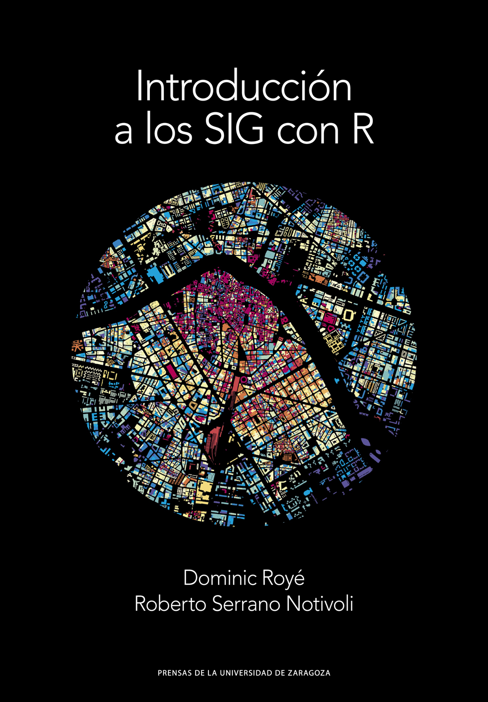

Datos para acompañar el libro 'Introducción a los SIG con R'
================

### Dominic Royé | Roberto Serrano Notivoli (2019)

Resumen
--------

R tiene, como lenguaje de programación enfocado al análisis estadístico, todos los ingredientes para ser usado como herramienta de análisis espacial y representación cartográfica: es gratuito, permite personalizar, replicar y compartir los análisis de cualquier nivel de dificultad y no tiene ninguna limitación en cuanto a cantidad de información a procesar o tipos de formato diferentes para gestionar. Esto le sitúa en una situación de ventaja que mejora día a día, gracias a su amplia comunidad de usuarios, respecto a un SIG (Sistema de Información Geográfica) convencional. Este manual explica, sin necesidad de conocimientos previos, cómo desarrollar con R todos los análisis disponibles en un SIG, con ejemplos sencillos y multitud de casos prácticos. Además, se muestran las enormes posibilidades de representación cartográfica, que van mucho más allá de la simple creación de mapas. R permite, desde exportar a cualquier formato de archivo, hasta crear mapas dinámicos para supublicación en Internet.

Estructura
--------

El libro está dividido en 9 capítulos:

1. Introducción: Breve introducción al uso de R para importar datos, hacer algunas transformaciones, conocer los tipos y clases de objetos y exportar los resultados. **[01_intro]**
2. Tidyverse: Explicación de los procedimientos posibles con este completísimo y actual paquete de funciones que nos permitirá importar, manipular y gestionar información alfanumérica de una manera sencilla y eficiente. **[02_tidyverse]**
3. ggplot2: Representación gráfica de datos con uno de los paquetes de funciones más populares del momento en R. Se da un repaso a los distintos tipos de representación posibles, así como a diversas opciones de visualización. **[03_ggplot2]**
4. Consideraciones iniciales: Breve explicación de algunos conceptos básicos sobre análisis espacial y cartografía que pueden ser útiles en caso de que aún no estés familiarizado con ellos. 
5. Análisis vectorial: Repaso de las funciones de análisis que pueden aplicarse sobre datos espaciales de naturaleza vectorial. Introducción al uso de diferentes paquetes de funciones. **[05_spatial_I]**
6. Análisis ráster: Similar al capítulo anterior, pero dedicado a los datos espaciales de naturaleza ráster. **[05_spatial_II]**
7. Visualización de mapas: Explicación de los diversos modos de visualización cartográfica, estática e interactiva. **[07_mapping]**
8. Casos prácticos: Colección de ejemplos en los que se pone en práctica la mayor parte de las funciones de análisis espacial estudiadas en los capítulos anteriores. **[09_extras]**
9. Extras: Introducción a algunas funciones o métodos adicionales de R que pueden ser de utilidad en el análisis espacial y la representación cartográfica. **[09_extras]**

Datos
--------

Todos los datos utilizados en los ejemplos de cada capítulo están disponibles en el repositorio de GitHub accesible a través de las carpetas correspondientes a cada capítulo. El feedback de los lectores es siempre bienvenido, tanto del libro en general como de los datos en particular. En el mismo repositorio de los datos existe una sección (**Issues**) en la que es posible interactuar con los autores a este respecto.

GitHub limita el espacio para grandes archivos, por eso en el capítulo Extras se debe descargar dos archivos de datos pesados desde Google Drive [aqui](https://drive.google.com/open?id=11wUeNOyG3SX2KqiJFuEmvH9t1IicuYw7). 

**Estado de actualización**: *10 de octubre de 2019*

Contacto
--------

- Dominic Royé: dominic.roye@usc.es, [@dr_xeo](https://twitter.com/dr_xeo), https://dominicroye.github.io/es/
- Roberto Serrano Notivoli: rserrano@eead.csic.es, https://www.researchgate.net/profile/Roberto_Serrano-Notivoli

Referencia
--------

#### Royé, D & Serrano Notivoli, R (2019). *Introducción a los SIG con R*. Prensa de la Universidad de Zaragoza. ISBN 978-84-1340-002-0

